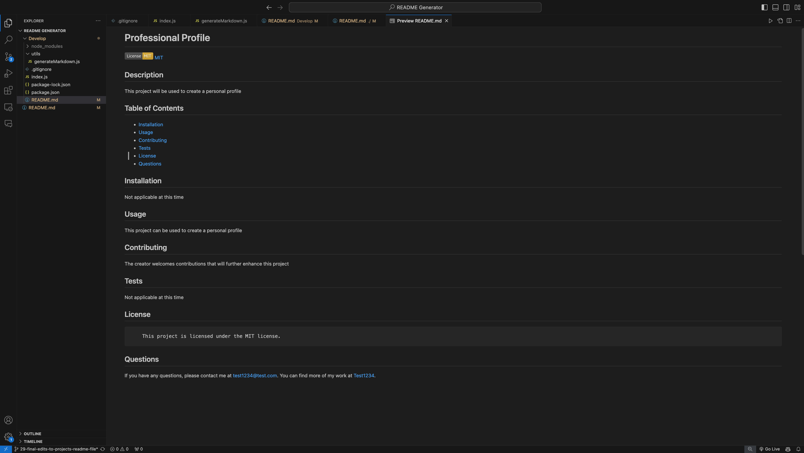

# README-Generator

## Description
This project was created in hopes to provide a professional README generator for users to have the means to write an efficient and quality read me file.

## Usage
As a user, I want a professional README generator, so that I can efficently and quickly create a quality read me file.

## Support
Please contact Alex Balara for further assistance.

## Roadmap
It is the creator's vision that this README Generator will continue to expand and stay up to date with best practices to create a quality README file.

## Contributing
As a new member to the field, this creator not only welcomes but encourages feedback on enhancements to this project.

## Authors and Acknowledgements
This project was created by Alex Balara with the assistance and utilization of Xpert Learning Assistant and Copilot, which were crucial components to the understanding and building of this project. 

## Visuals
This image shows the generated README File that was used to demonstrate the functionality of this project as depicted in the screencastify video:

## Links
The below links provides a walk through of the functionality of the the README Generator:
https://app.screencastify.com/v3/watch/GxVIybYPLM9bHt5zoPGy

The below link will navigate to the GitHub Repository for this project:
https://github.com/abalara4/README-Generator.git

## License
None